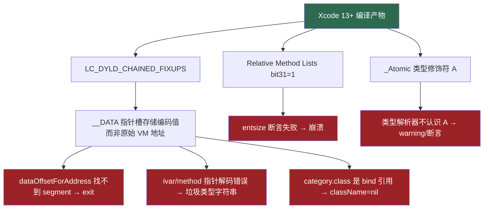

# 修复总览

本目录记录了 class-dump 为支持现代 arm64 二进制（Xcode 13+）所做的修复。

## 修复文档列表

| 文档 | 问题 | 影响范围 |
|------|------|----------|
| [01-modern-macho-support.md](01-modern-macho-support.md) | 新 Load Command 不认识 + Chained Fixup Pointer 解码 | `CDLoadCommand.m`, `CDMachOFile.m`, `CDLCSegment.m` |
| [02-relative-method-lists.md](02-relative-method-lists.md) | iOS 14+ Relative Method Lists 解析 | `CDObjectiveC2Processor.m` |
| [03-atomic-type-modifier.md](03-atomic-type-modifier.md) | `_Atomic`（`A`）类型修饰符不认识 | `CDTypeParser.m`, `CDType.m` |
| [04-robustness-fixes.md](04-robustness-fixes.md) | assert/exit 导致崩溃，nil/空字符串未保护 | 多处 |
| [05-null-filename-fix.md](05-null-filename-fix.md) | Category 头文件名出现 `(null)` | `CDMultiFileVisitor.m` |
| [06-segment-fileoffset-fix.md](06-segment-fileoffset-fix.md) | 地址落在 section 间隙时偏移计算错误 | `CDLCSegment.m` |

---

## 核心问题根源



---


## 编译方法

```bash
# 仅 arm64
xcodebuild -scheme class-dump -configuration Release \
  -derivedDataPath build ARCHS=arm64 ONLY_ACTIVE_ARCH=YES

# arm64 + x86_64 Fat Binary
xcodebuild -scheme class-dump -configuration Release \
  -derivedDataPath build ARCHS='arm64 x86_64' ONLY_ACTIVE_ARCH=NO

# 产物路径
build/Build/Products/Release/class-dump
```
