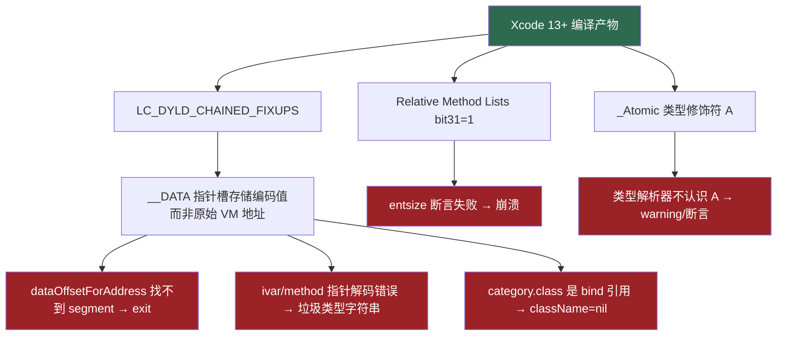

# 修复总览

本目录记录了 class-dump 为支持现代 arm64 二进制（Xcode 13+）所做的修复。

## 修复文档列表

| 文档 | 问题 | 影响范围 |
|------|------|----------|
| [01-modern-macho-support.md](01-modern-macho-support.md) | 新 Load Command 不认识 + Chained Fixup Pointer 解码 | `CDLoadCommand.m`, `CDMachOFile.m`, `CDLCSegment.m` |
| [02-relative-method-lists.md](02-relative-method-lists.md) | iOS 14+ Relative Method Lists 解析 | `CDObjectiveC2Processor.m` |
| [03-atomic-type-modifier.md](03-atomic-type-modifier.md) | `_Atomic`（`A`）类型修饰符不认识 | `CDTypeParser.m`, `CDType.m` |
| [04-robustness-fixes.md](04-robustness-fixes.md) | assert/exit 导致崩溃，nil/空字符串未保护 | 多处 |
| [05-null-filename-fix.md](05-null-filename-fix.md) | Category 头文件名出现 `(null)` | `CDMultiFileVisitor.m` |
| [06-segment-fileoffset-fix.md](06-segment-fileoffset-fix.md) | 地址落在 section 间隙时偏移计算错误 | `CDLCSegment.m` |

---

## 核心问题根源



---

## 调试脚本

调试过程中用到的 Python 脚本，保存在 `docs/scripts/` 目录：

| 脚本 | 用途 |
|------|------|
| [01_parse_load_commands.py](scripts/01_parse_load_commands.py) | 解析 LC_DYLD_CHAINED_FIXUPS，输出每个 segment 的 pointer_format，判断用哪种解码方式 |
| [02_decode_chained_fixup.py](scripts/02_decode_chained_fixup.py) | 验证 chained fixup pointer 解码逻辑，对比 36-bit 绝对地址 vs 32-bit offset 两种方式，验证 __PAGEZERO 过滤 |
| [03_trace_class_ivar.py](scripts/03_trace_class_ivar.py) | 追踪第一个 ObjC 类的完整结构链（classlist → class_t → class_ro_t → ivar_list），验证 ivar name/type 指针解码是否正确 |

**用法示例：**

```bash
# 查看 pulu 的 chained fixup pointer format
python3 docs/scripts/01_parse_load_commands.py /path/to/aaa.app/aaa

# 验证解码逻辑
python3 docs/scripts/02_decode_chained_fixup.py /path/to/aaa.app/aaa

# 追踪 ivar 解析链
python3 docs/scripts/03_trace_class_ivar.py /path/to/aaa.app/aaa
```

---

## 编译方法

```bash
# 仅 arm64
xcodebuild -scheme class-dump -configuration Release \
  -derivedDataPath build ARCHS=arm64 ONLY_ACTIVE_ARCH=YES

# arm64 + x86_64 Fat Binary
xcodebuild -scheme class-dump -configuration Release \
  -derivedDataPath build ARCHS='arm64 x86_64' ONLY_ACTIVE_ARCH=NO

# 产物路径
build/Build/Products/Release/class-dump
```
